# MED5018_Group2-Final-Project

## WELCOME!

This repository contains the final project of Group 2 for the MED5018 course at the Southern University of Science and Technology. Our team members are Xinying Wang, Jiaying Hu, Tingting Shen and Guangmei Yang .

## Project Overview

We mainly investigated the epidemic trends between different regions from 1990 to 2019. The results of our study will help us better understand how epidemiological transitions have developed in different regions of the world, how regional differences exist. Our team used K-Means clustering, principal component analysis and liner regression analysis to analyze data.  Our title is "Association between resource inequality and causes of death in 204 countries and regions from 1990 to 2019".

## Dependencies

pandas 

numpy 

math 

sklearn.cluster.KMeans 

sklearn.decomposition.PCA 

statsmodels.api 

matplotlib 

## Key foundings

The project yielded several important findings:  
(1) 204 regions can be divided into three categories based on different causes of death.
(2) The first category should be countries with small land area and population, and moderate development level. The second category should be countries with large land area and population, and relatively backward development level. The third category should be countries with large land area and population, and high development level.  
(3) Cardiovascular diseases have the highest mortality rate in most countries.  
(4) Cardiovascular disease remains a major health challenge on a global scale, especially in Asia, where the growth rate of deaths is of concern. In Europe and the Americas, although the growth rate of cardiovascular disease deaths is relatively slow, it does not mean that it can be ignored.  
(5) The increasing trend of deaths from non-communicable diseases worldwide suggests the need to strengthen public health interventions to prevent and control the development of these diseases.  

## Visualization results
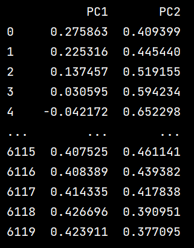
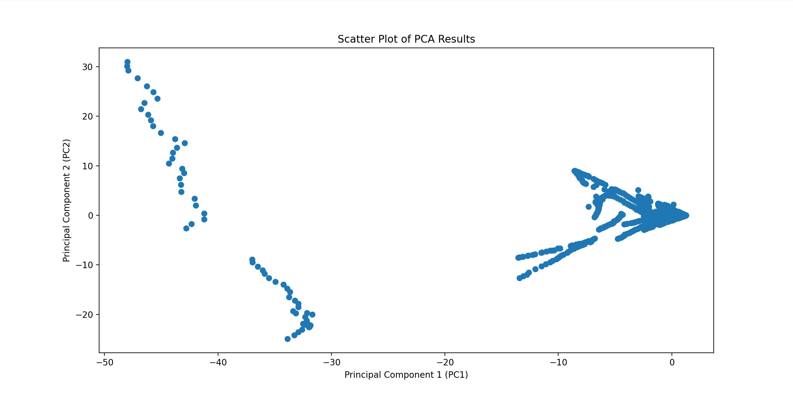
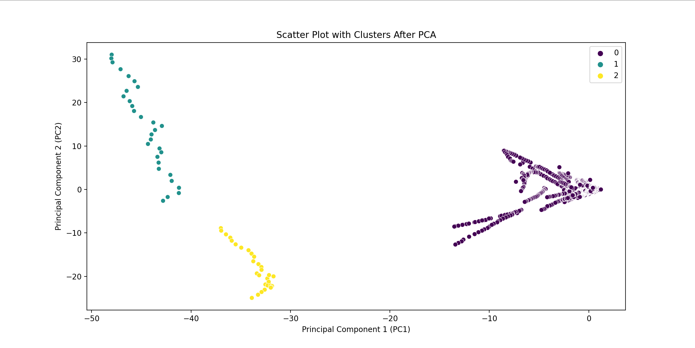
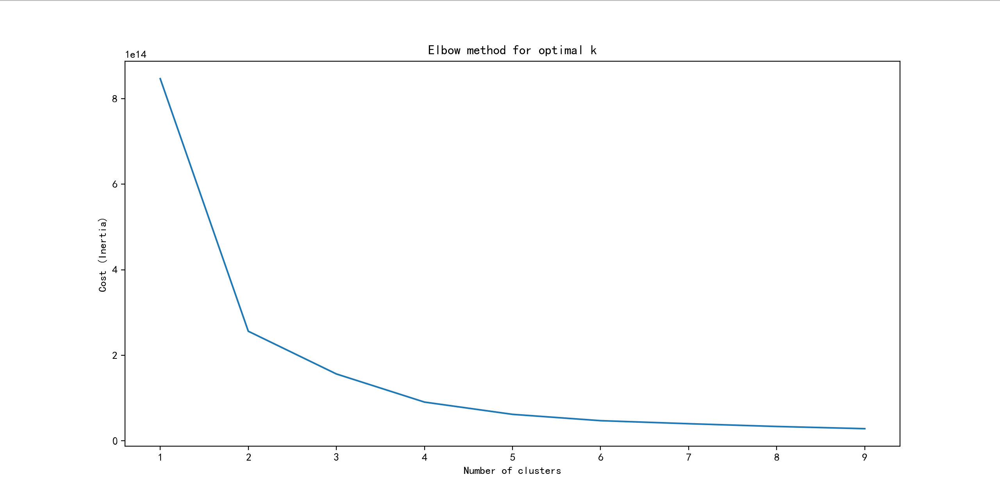
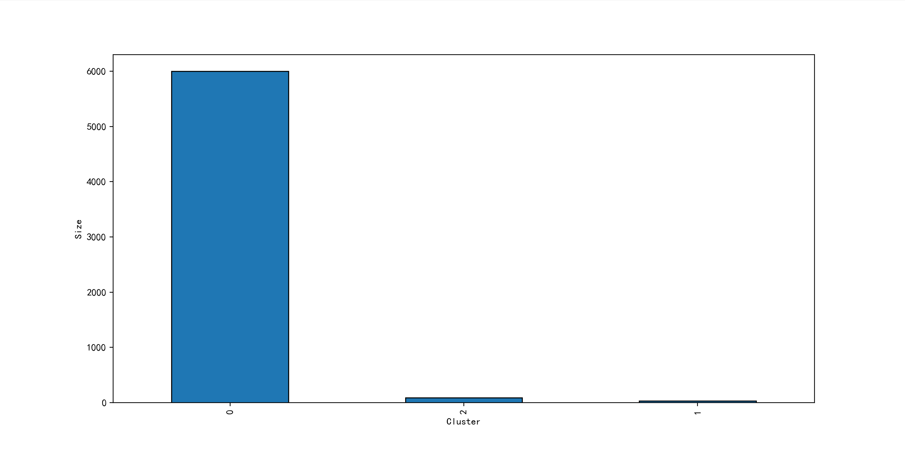
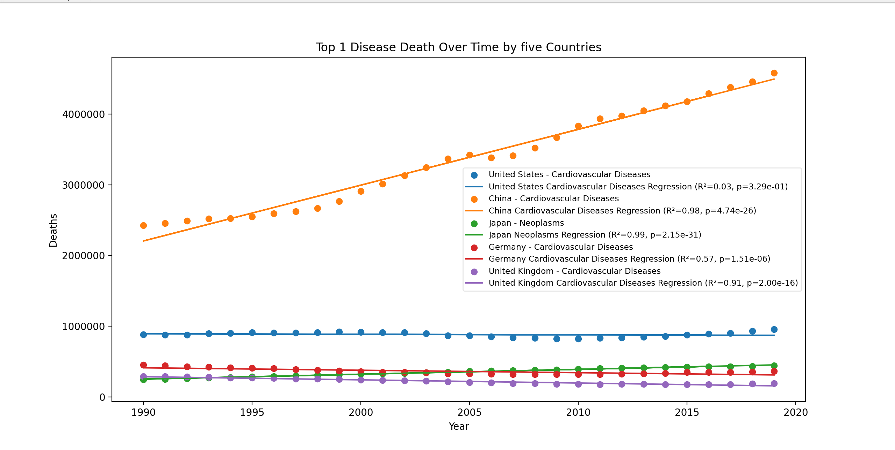
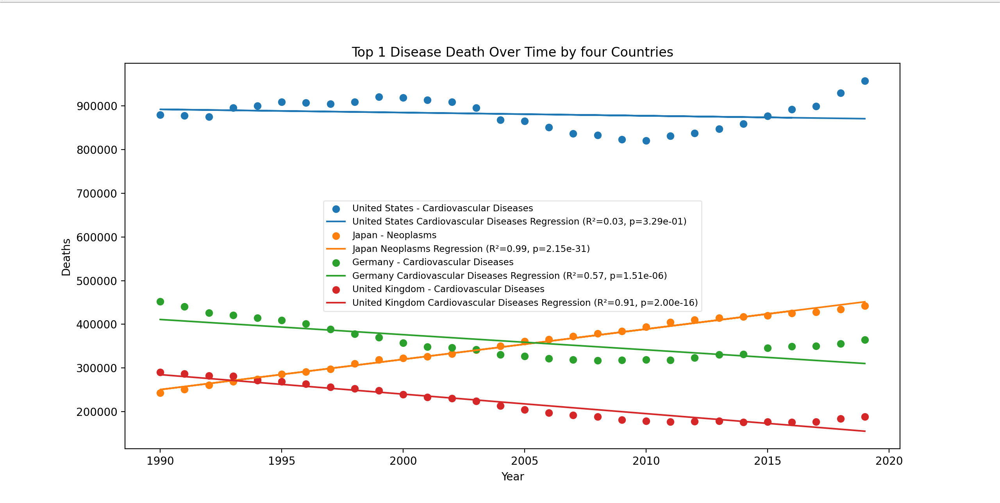
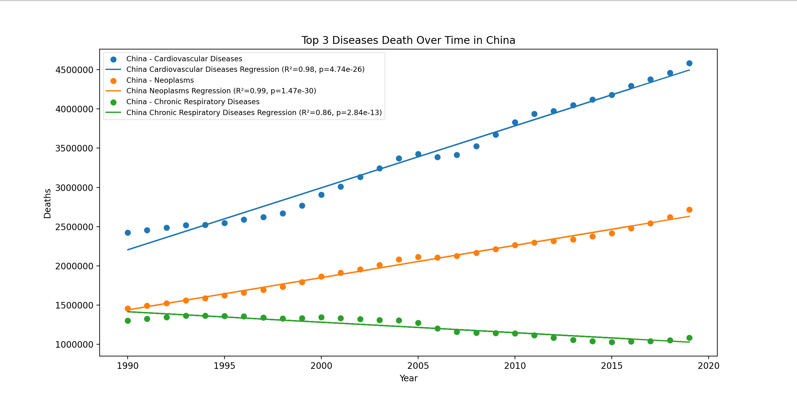
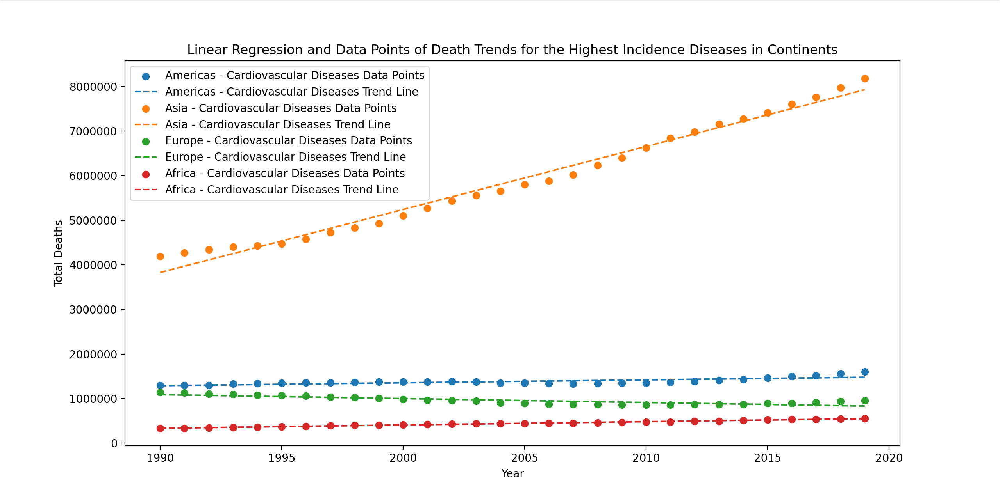
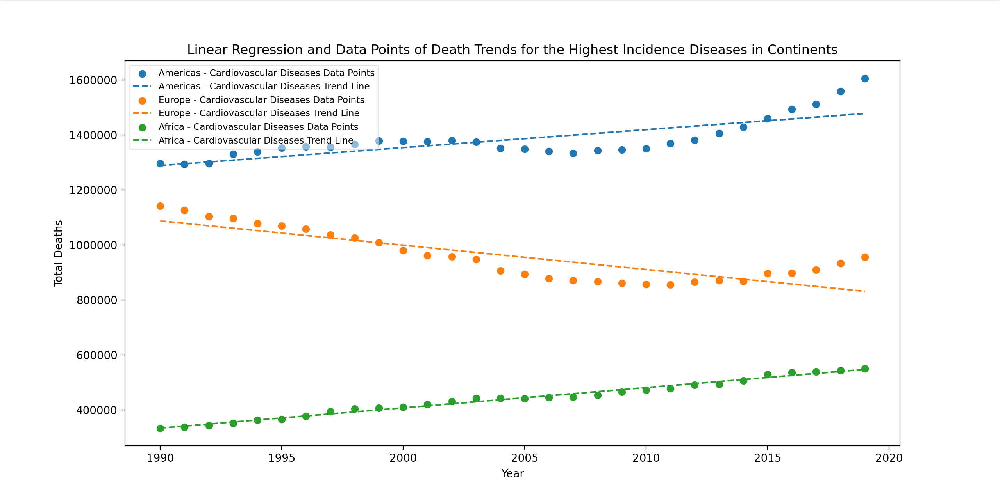
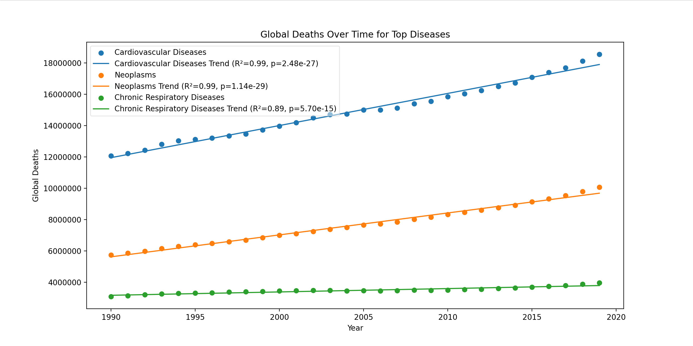

## Acknowledgments  
This study was supervised by Ruilin Tian. The authors would like to thank Dongyang Jin.
